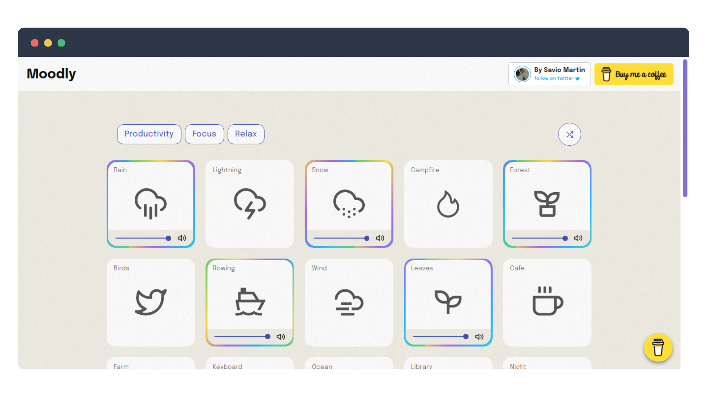
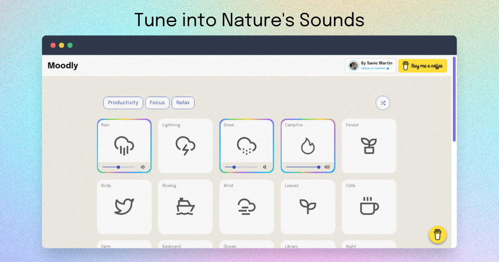

<h1 align="center">Moodly 🎵</h1>

<p align="center">
<a href="https://github.com/saviomartin/moodly/blob/master/LICENSE" target="blank">

</a>
<a href="https://github.com/saviomartin/moodly/fork" target="blank">

</a>
<a href="https://github.com/saviomartin/moodly/stargazers" target="blank">

</a>
<a href="https://github.com/saviomartin/moodly/issues" target="blank">

</a>
<a href="https://github.com/saviomartin/moodly/pulls" target="blank">

</a>
<a href="https://twitter.com/intent/tweet?text=moodly.site%20%F0%9F%8E%B5%0A%0AGet%20a%20better%20sense%20of%20focus%20and%20relaxation%20when%20listening%20to%20the%20nature%20sounds."></a>

</p>

<p align="center"></p>

<p align="center">
    <a href="https://moodly.site/" target="blank">View Demo</a>
    ·
    <a href="https://github.com/saviomartin/moodly/issues/new/choose">Report Bug</a>
    ·
    <a href="https://github.com/saviomartin/moodly/issues/new/choose">Request Feature</a>
</p>

### Introducing Moodly.site ✌️

Get a better sense of focus and relaxation when listening to ambient nature sounds. Focus on what's important and be productive by 2x.

## 🚀 Demo

<a href="https://moodly.site/" target="blank">

</a>

Try the App: [moodly.site](https://moodly.site/)

## 🧐 Features

- 💯 **23+ Nature Sounds**
- 🎩 **Mulitiple Tracks** (Productivity, Focus, Relaxation)
- 👾 **Shuffle Sounds**
- 📦 **Distraction free**
- 💻 **Fully Responsive**

Improove your focus and relaxation by tuning into [moodly.site](https://moodly.site/) ✨️

## 🛠️ Installation Steps

1. Clone the repository

```bash
git clone https://github.com/saviomartin/moodly.git
```

2. Change the working directory

```bash
cd moodly
```

3. Install dependencies

```bash
npm install
```

4. Run the app

```bash
npm run dev
```

You are all set! Open [localhost:3000](http://localhost:3000/) to see the app.

## 🍰 Contributing

- Please contribute using [GitHub Flow](https://guides.github.com/introduction/flow). Create a branch, add commits, and [open a pull request](https://github.com/saviomartin/moodly/compare).

- Please read [`CONTRIBUTING`](CONTRIBUTING.md) for details on our [`CODE OF CONDUCT`](CODE_OF_CONDUCT.md), and the process for submitting pull requests to us.

## 💻 Built with

- [Next JS](https://nextjs.org/)
- [react-icons](https://react-icons.github.io/react-icons/): for icons
- [nprogress](https://www.npmjs.com/package/nprogress): for slim progressbars
- [react-hot-toast](https://react-hot-toast.com/): for toasts
- [Material UI](http://material-ui.com/): for components
- [Vercel](http://vercel.com/): for hosting

## 🛡️ License

This project is licensed under the MIT License - see the [`LICENSE`](LICENSE) file for details.

## 🦄 Deploy

<a href="https://vercel.com/new/project?template=https://github.com/saviomartin/moodly">

</a>
<a href="https://app.netlify.com/start/deploy?repository=https://github.com/saviomartin/moodly">

</a>
<a href="https://cloud.digitalocean.com/apps/new?repo=https://github.com/saviomartin/moodly">

</a>

## 👨‍💻 Author

### 👤 Savio Martin

- Twitter: [@SavioMartin7](https://twitter.com/SavioMartin7)
- Github: [@saviomartin](https://github.com/saviomartin)
- Hashnode: [@saviomartin](https://hashnode.com/@saviomartin)

## 🙏 Support

This project needs a ⭐️ from you. Don't forget to leave a star ⭐️

If you found the app helpful, consider supporting me with a coffee.

<a href="https://www.buymeacoffee.com/saviomartin">

</a>

---

<h3 align="center">
Moodly needs a ⭐️ from you
</h3>
